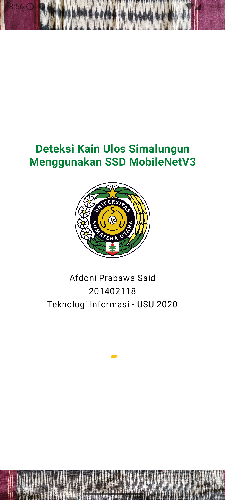
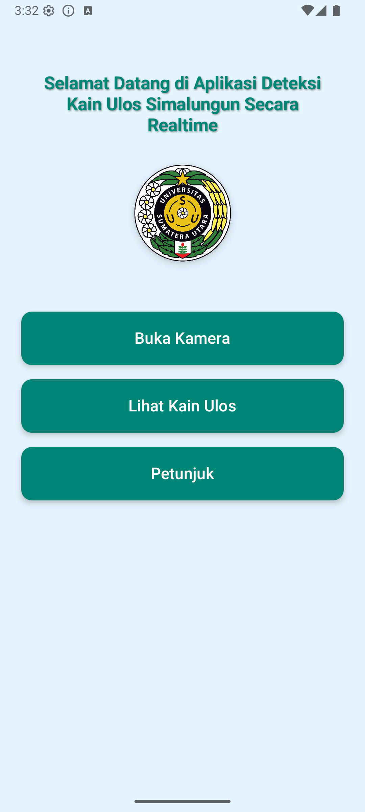
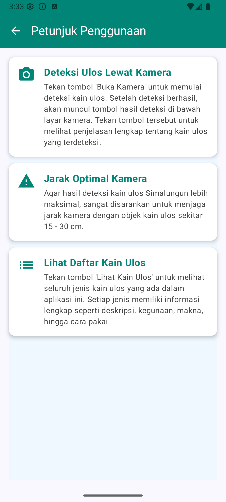
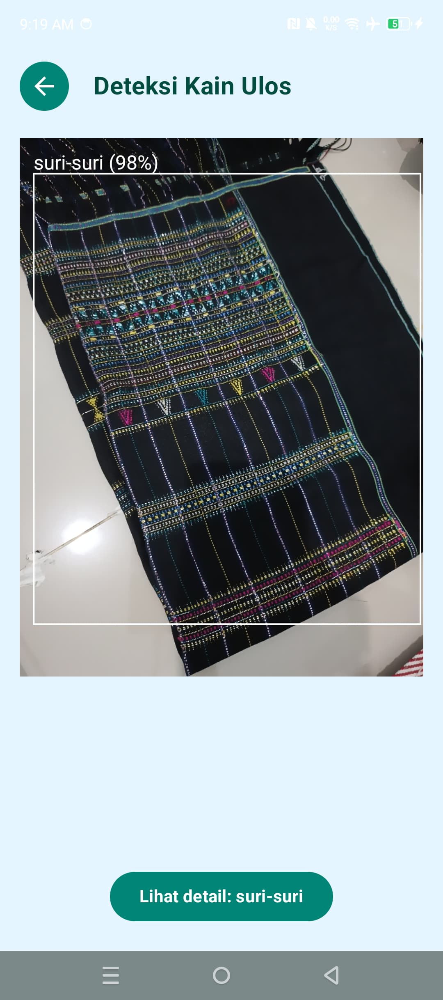
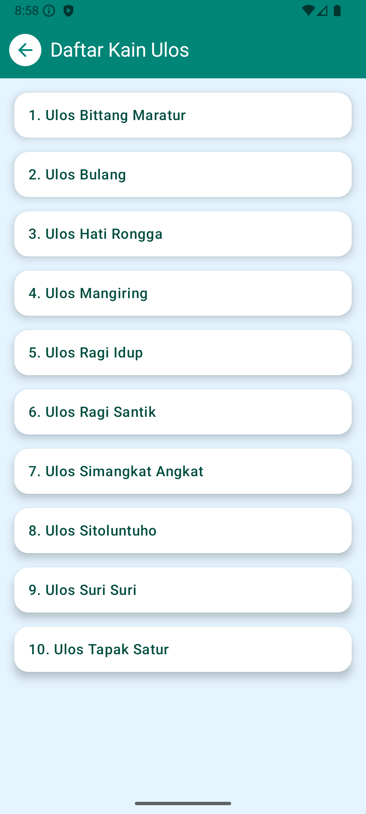
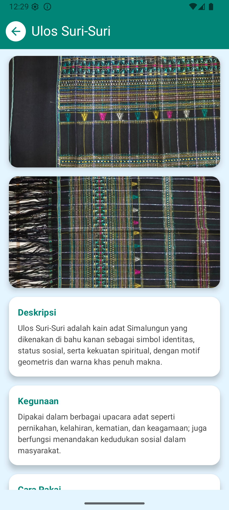
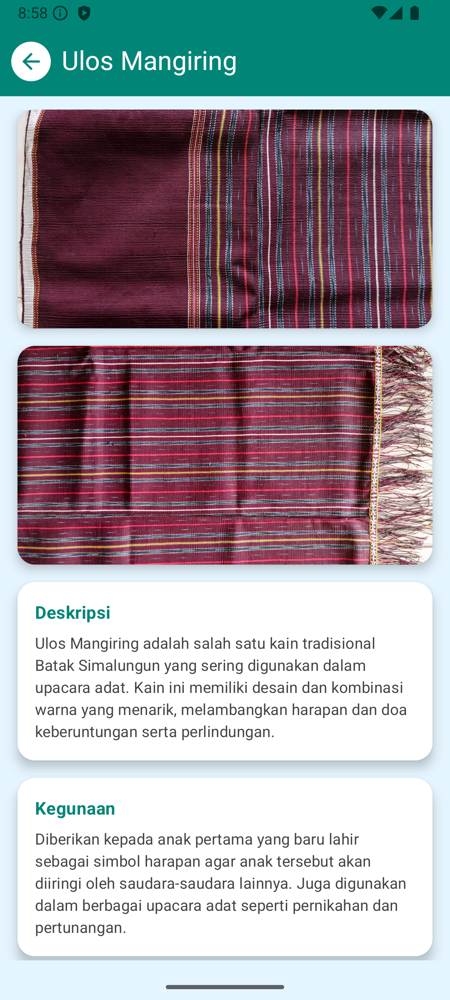

# Real-Time Detection Application for Simalungun Ulos Fabric Using SSD MobileNetV2 FPN

The Real-Time Simalungun Ulos Fabric Detection Application is an application that is expected to serve as a platform for introducing and educating the public, especially the younger generation, about the culture of Simalungun Ulos fabric. This application can directly detect Simalungun Ulos fabric objects and classify them into specific categories. Not only does it classify the fabric, but it also provides detailed explanations about the Ulos Simalungun fabric, including its description, usage instructions, meaning, and additional information. The application was developed by implementing the SSD algorithm model as the decision-making mechanism, MobileNetV2 as the backbone or feature extractor, and FPN (Feature Pyramid Network) to extract the smallest features from the Ulos Simalungun fabric, thereby achieving optimal accuracy in real-time detection.

# Display of Application Page
### Splash Screen Page

Splash Screen => This is the first menu that appears when you open the application.

### Main Screen

Home Page => This page contains three buttons that link to separate pages: “Camera Detection,” “View Ulos Fabric,” and “Instructions.”

### Instructions Screen

Instructions => This page provides instructions on how to use the application, starting from how to use the camera to detect and identify the types of ulos fabric that can be detected, which in this case are 10 types of Simalungun ulos fabric.

### Camera Detection Page

Camera Detection => This page is the main feature of the app where users can use the camera to detect Simalungun Ulos fabric in real time. Once the app has successfully detected the Ulos fabric, a clickable button will appear, directing users to the Simalungun Ulos fabric description page.

### Ulos Fabric View Page

See Ulos Fabric => This page lists 10 types of Simalungun Ulos fabric, including: Ulos Bulang, Tapak Catur, Ragi Santik, Ragi Idup, Hati Rongga, Sitoluntuho, Mangiring, Simangkat Angkat, and Bittang Maratur.

# General architecture

# Program Demo Link
Link Youtube :  ([Youtube](https://www.youtube.com/watch?v=eXjBbV1DBzg&ab_channel=KokotiSaid))
